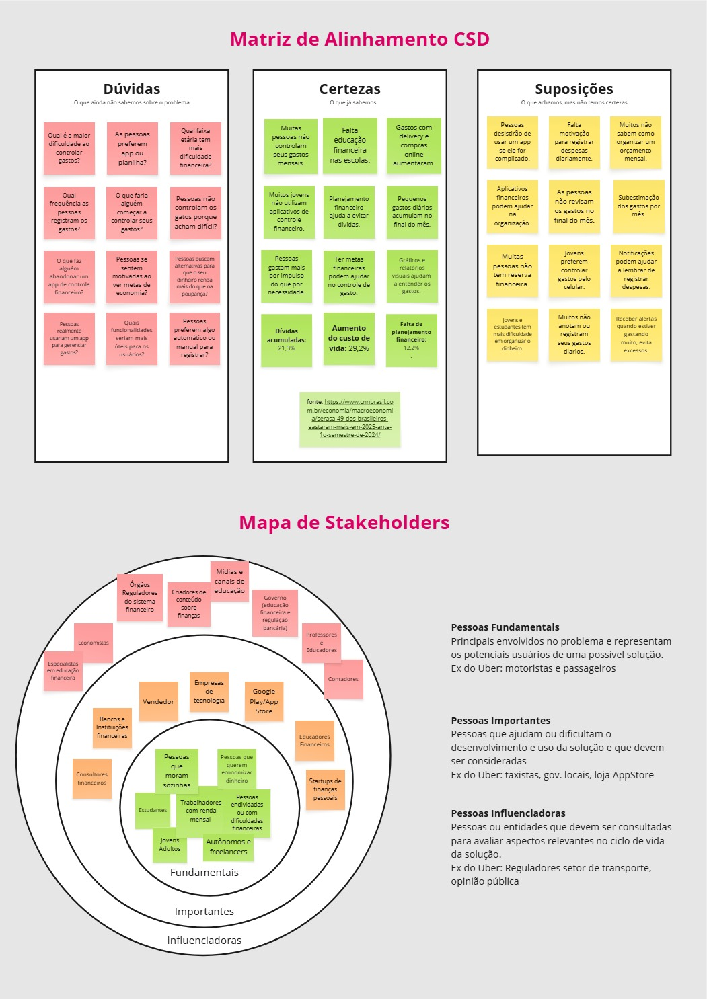
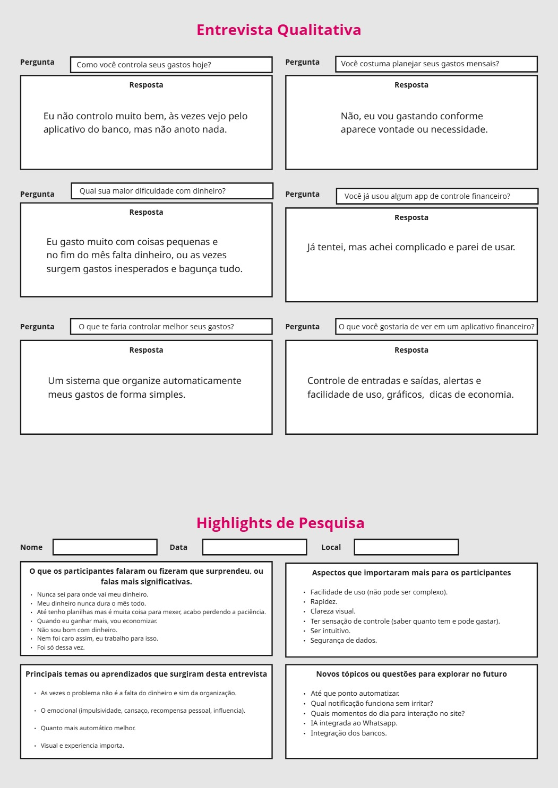
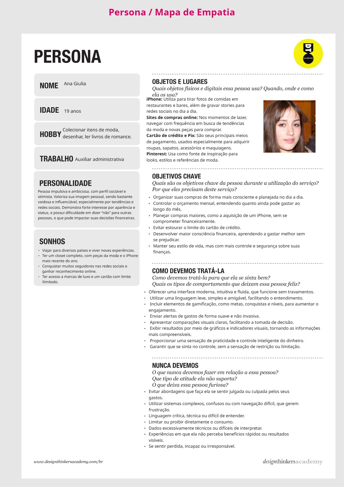
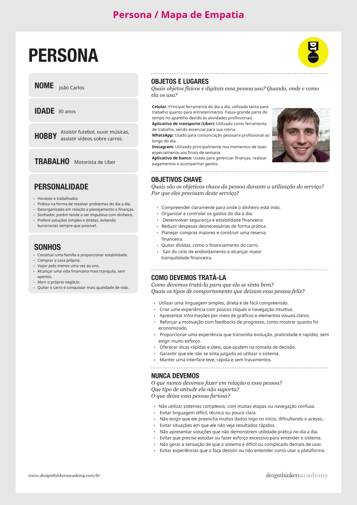
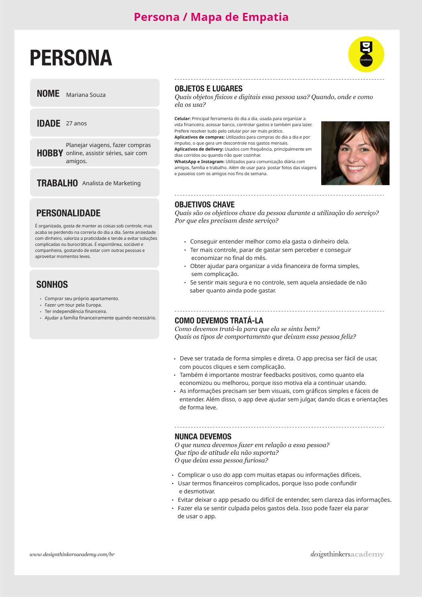

# Product discovery

Pré-requisitos: <a href="01-Contexto.md"> Documentação de contexto</a>

✅ [Documentação de Design Thinking (MIRO)](files/processo-dt.pdf)

## Etapa de entendimento
> * **Matriz CSD** e **Mapa de stakeholders**:

> * **Entrevistas qualitativas** e **Highlights de pesquisa**: 

## Etapa de definição

### Personas

> * **Persona 1 - Ana Giulia**:

> * **Persona 2 - João Carlos**:

> * **Persona 3 - Mariana Souza**:

