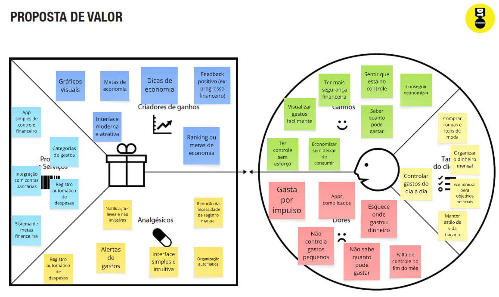
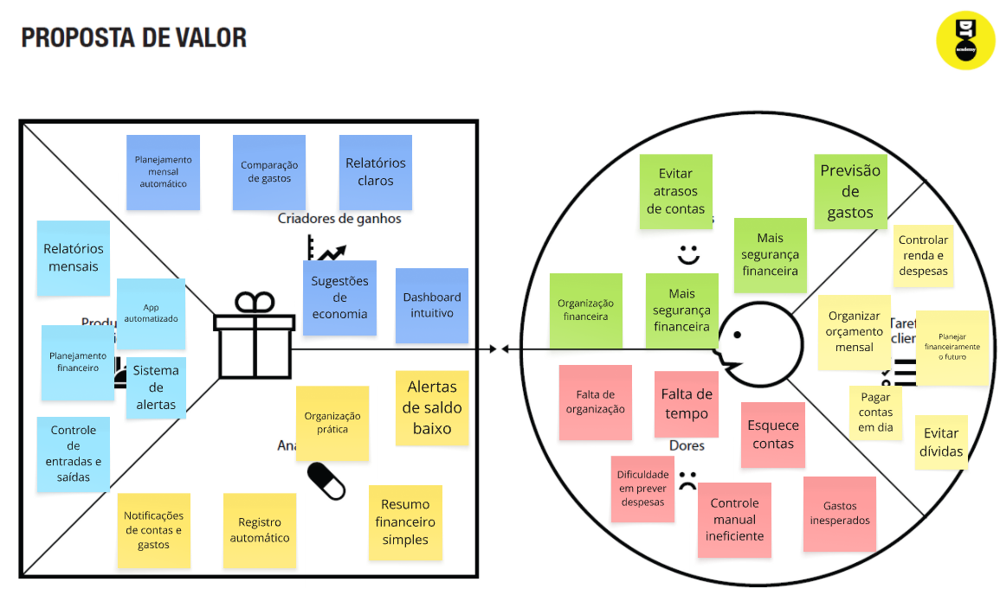
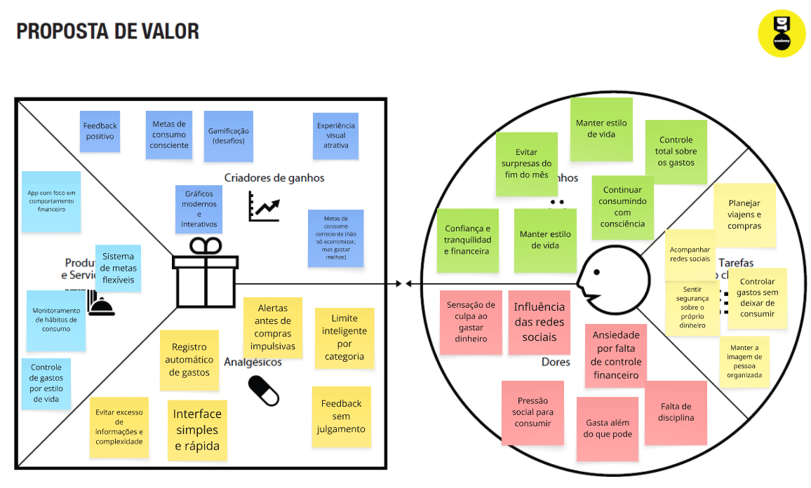

# Product design

## Histórias de usuários

Com base na análise das personas, foram identificadas as seguintes histórias de usuários:

|EU COMO... `PERSONA`| QUERO/PRECISO ... `FUNCIONALIDADE` |PARA ... `MOTIVO/VALOR`                 |
|--------------------|------------------------------------|----------------------------------------|
|Ana Giulia  | Organizar meus gastos mensais         | Saber quanto dinheiro vai sobrar         |
|João Carlos       | Juntar dinheiro para quitar um carro         | Ter uma dívida a menos e conseguir lucrar mais com o trabalho de uber |
Mariana Souza | Economizar no dinheiro | Dar entrada no meu apartamento 
Ana Giulia | Saber meus maiores gastos mensais | Saber para onde vai a maioria do meu salário 
João Carlos | Organizar/contabilizar minha renda diária | Ver quais dias eu ganho mais 
Ana Giulia | Alertas de gastos | Evitar ultrapassar meu limite 
João Carlos | Saber quanto eu posso gastar | Evitar criar dívidas sem querer 
João Carlos | Planejamento financeiro | Ter mais segurança no futuro | 
Ana Giulia | Controlar gastos por categoria (moda, beleza, lazer) | Manter meu estilo sem ultrapassar meu orçamento 
Mariana Souza | Ter controle nos gastos | Planejar melhor viagens 
Ana Giulia | Um app simples de controle financeiro | Entender melhor meus gastos no dia a dia

## Proposta de valor

##### Proposta para a persona Ana Giulia 

##### Proposta para a persona João Carlos

##### Proposta para a persona Mariana Souza

## Requisitos

### Requisitos funcionais

| ID     | Descrição do Requisito                                   | Prioridade |
| ------ | ---------------------------------------------------------- | ---------- |
| RF-001 | O usuário deve conseguir realizar cadastro | ALTA
| RF-002 | O usuário deve conseguir realizar login | ALTA
| RF-003 | O usuário deve conseguir alterar despesas e entradas | ALTA
| RF-004 | O usuário deve conseguir excluir despesas E entradas | ALTA
| RF-005 | Calcular o saldo total automaticamente | ALTA
| RF-006 | O usuário deve conseguir visualizar seus dados cadastrais | ALTA
| RF-007 | O usuário deve conseguir editar seus dados pessoais | ALTA
| RF-008 | O usuário deve conseguir encerrar sua sessão | ALTA
| RF-009 | Alteração de senha | ALTA
| RF-010 | O usuário deve conseguir realizar a exclusão da conta | ALTA
| RF-011 | O usuário deve conseguir visualizar suas despesas | MÉDIA
| RF-012 | O usuário deve conseguir filtrar despesas por período | MÉDIA
| RF-013 | O usuário deve conseguir visualizar despesas por categoria | MÉDIA
| RF-014 | O usuário deve conseguir visualizar um resumo mensal dos gastos | MÉDIA
| RF-015 | O usuário deve conseguir selecionar a forma de pagamento | MÉDIA
| RF-016 | O usuário deve conseguir cadastrar múltiplas formas de pagamento | MÉDIA
| RF-017 | O usuário deve conseguir ativar ou desativar notificações | MÉDIA
| RF-018 | Enviar notificações de alertas ao usuário | MÉDIA
| RF-019 | O usuário deve conseguir definir limites de gastos mensaiS | MÉDIA
| RF-020 | O usuário deve conseguir configurar preferências do sistema | MÉDIA
| RF-021 | O usuário deve conseguir adicionar ou alterar uma foto de perfil | MÉDIA
| RF-022 | Personalização de categorias | BAIXA
| RF-023 | Planejamento de despesas e entradas futuras  | BAIXA
| RF-024 | Alteração da moeda utilizada no sistema | BAIXA

### Requisitos não funcionais

| ID      | Descrição do Requisito                                                              | Prioridade |
| ------- | ------------------------------------------------------------------------------------- | ---------- |
| RNF-001 | O sistema deve garantir a segurança dos dados do usuário | ALTA |
| RNF-002 | A interface deve ser simples e intuitiva para o usuário | ALTA |
| RNF-003 | A interface deve possuir design responsivo e personalizado | ALTA |
| RNF-004 | O sistema deve possuir código organizado e documentado | ALTA |
| RNF-005 | O sistema deve possuir boa usabilidade para diferentes perfis de usuários | MÉDIA |
| RNF-006 | O sistema deve processar as requisições do usuário em no máximo 3 segundos | MÉDIA |
| RNF-007 | O sistema deve permitir fácil manutenção e atualização | BAIXA |

## Restrições

O projeto está restrito aos itens apresentados na tabela a seguir.

|ID| Restrição                                             |
|--|-------------------------------------------------------|
|001| Não haverá integração com bancos ou instituições financeiras|
|002| Não haverá integração automática com contas bancárias |
|003| Os dados dependerão exclusivamente do preenchimento manual do usuário | 
|004| O sistema será desenvolvido inicialmente apenas para ambiente web | 
|005| O sistema não poderá ter uma interface difícil | 
|006| O sistema dependerá exclusivamente das informações fornecidas pelo usuário | 
|007| O sistema não terá suporte a múltiplos idiomas inicialmente |
|008| O sistema será desenvolvido com tecnologias web (HTML, CSS e JavaScript) |

