# Projeto de interface

 ## User flow

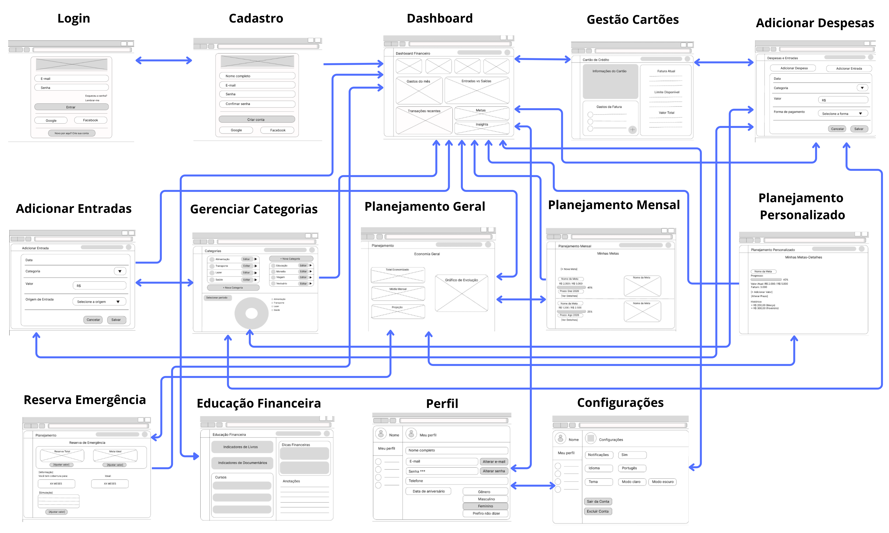

## Wireframes

## Tela de Login

A tela de login tem como objetivo permitir que os usuários acessem o sistema por meio de suas credenciais, utilizando e-mail e senha cadastrados. Caso seja o primeiro acesso, o usuário possui a opção de realizar seu cadastro, sendo redirecionado para a tela de cadastro. 

Se o usuário esquecer a senha, a interface possui a função de recuperação de senha, permitindo a redefinição da senha. Além disso,  há opção de manter o usuário conectado no sistema, sem a necessidade de realizar um novo login em acessos futuros no mesmo dispositivo. 

A tela também oferece alternativas de autenticação por meio de contas externas, como Google e Facebook. 

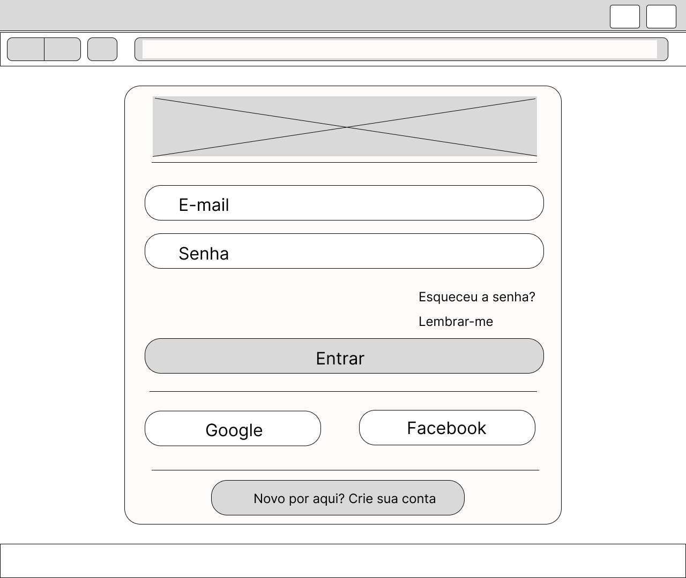

## Tela de Cadastro 

A tela de cadastro tem como objetivo permitir que novos usuários criem uma conta para acessar o sistema. Para isso, no cadastro são solicitadas informações, como nome completo, e-mail e senha, garantindo a identificação e segurança do usuário. Além disso, a tela também oferece opção de cadastramento por meio de contas externas, como Google e Facebook, sendo os dados preenchidos automaticamente com base nas informações fornecidas da plataforma escolhida. 

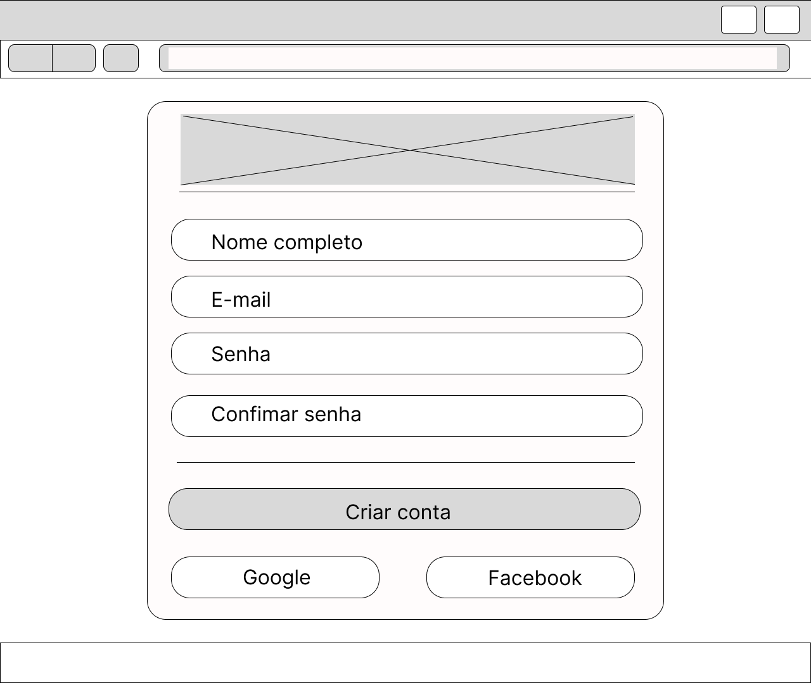

## Dashboard Financeiro

A tela de dashboard tem como objetivo apresentar ao usuário uma visão geral da sua situação financeira, permitindo o acompanhamento rápido de suas movimentações. Nela são exibidas informações essenciais, como saldo atual e totais de entradas e saídas. A interface também conta com gráficos de gastos do mês, que auxiliam na visualização da distribuição das despesas ao longo do período, além de um gráfico de comparação de valores de entrada e saída. 

Além do mais, a tela apresenta também uma seção de transações recentes, permitindo que o usuário acompanhe suas últimas movimentações financeiras. São exibidas metas financeiras, com o intuito de incentivar o usuário no controle financeiro e insights que ajudam o usuário a entender seus hábitos de consumo para tomar melhores decisões. 

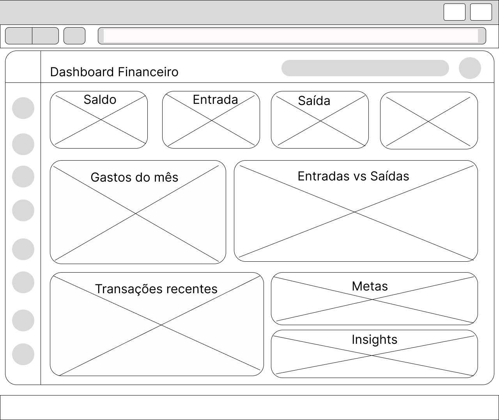

## Gestão de Cartão de Crédito

Esta tela permite que o usuário insira e gerencie as informações do cartão de crédito, como limite, valor da fatura e despesas realizadas. A partir desses dados inseridos, é possível acompanhar os gastos de forma organizada, facilitando o controle financeiro e auxiliando na tomada de decisões para evitar excessos. Além disso, o usuário possui a opção de ser redirecionado para a tela de adicionar despesas, que serão acrescentadas nos gastos da fatura. 

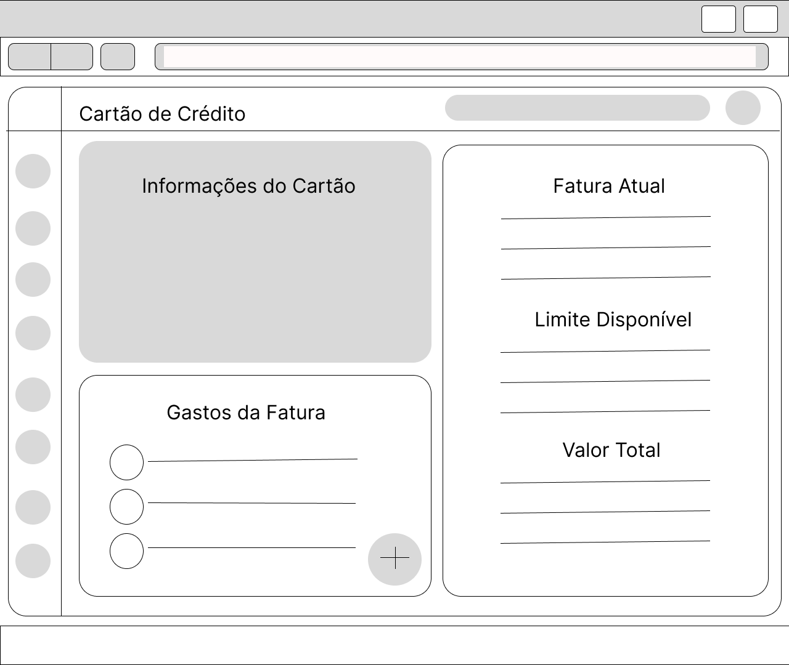

## Tela de Despesas e Entradas

Esta tela tem como objetivo permitir o registro detalhado de despesas, onde o usuário poderá inserir o valor, selecionar a forma de pagamento (dinheiro, cartão ou Pix), definir a data e escolher a categoria correspondente. Além disso, a tela também possui a opção de adicionar entrada, onde o usuário será redirecionado para outra página. 

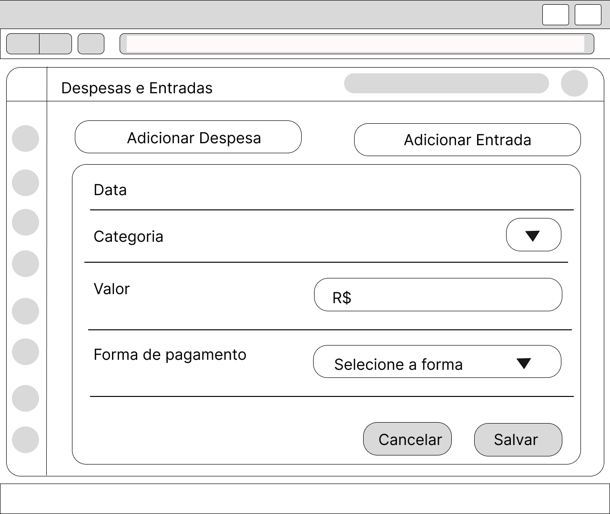

## Tela de Adicionar Entrada

Esta tela tem como objetivo permitir o registro detalhado de entradas financeiras, onde o usuário poderá inserir o valor recebido, selecionar a forma de recebimento (dinheiro, transferência, Pix, entre outros), definir a data e escolher a categoria correspondente (como salário, renda extra ou investimentos).

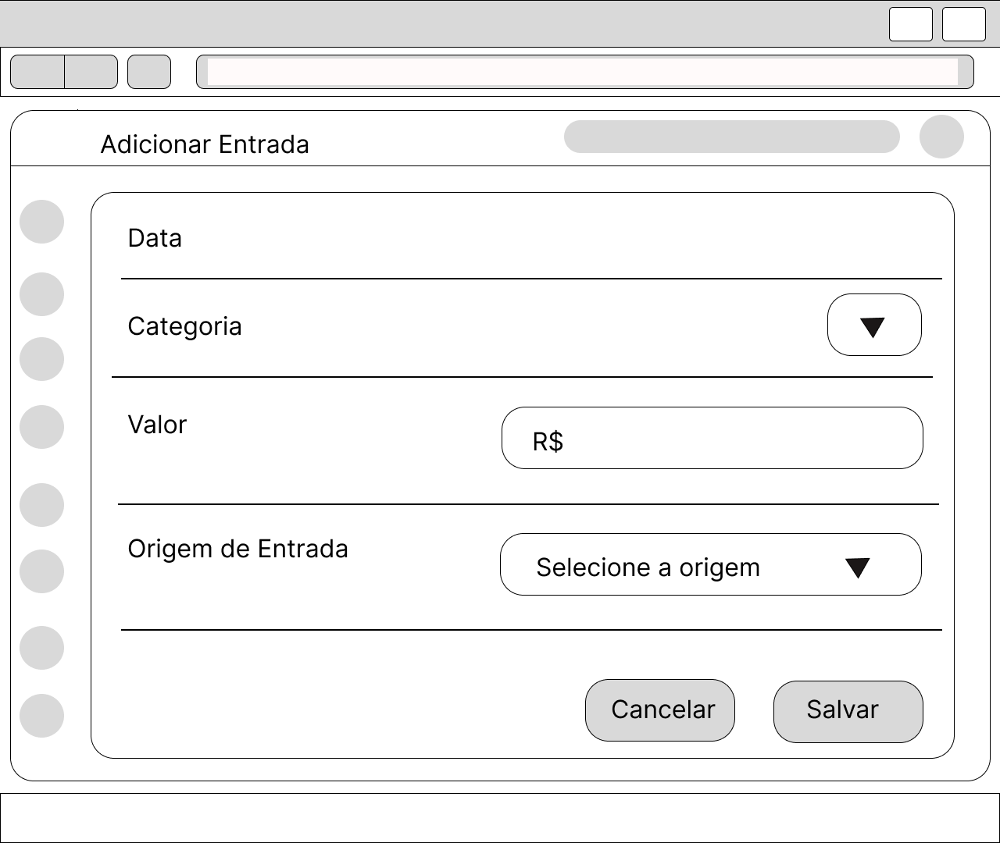

## Gerenciamento de Categorias 

Permite ao usuário organizar suas finanças por meio da criação, edição e visualização de categorias de receitas e despesas, além de acompanhar os gastos com o auxílio de gráficos. Por exemplo, o usuário pode criar categorias como alimentação, transporte e lazer, editar uma categoria existente (como alterar lazer para entretenimento), adicionar novas categorias como educação e visualizar gráficos que mostram a porcentagem de gastos em cada categoria.

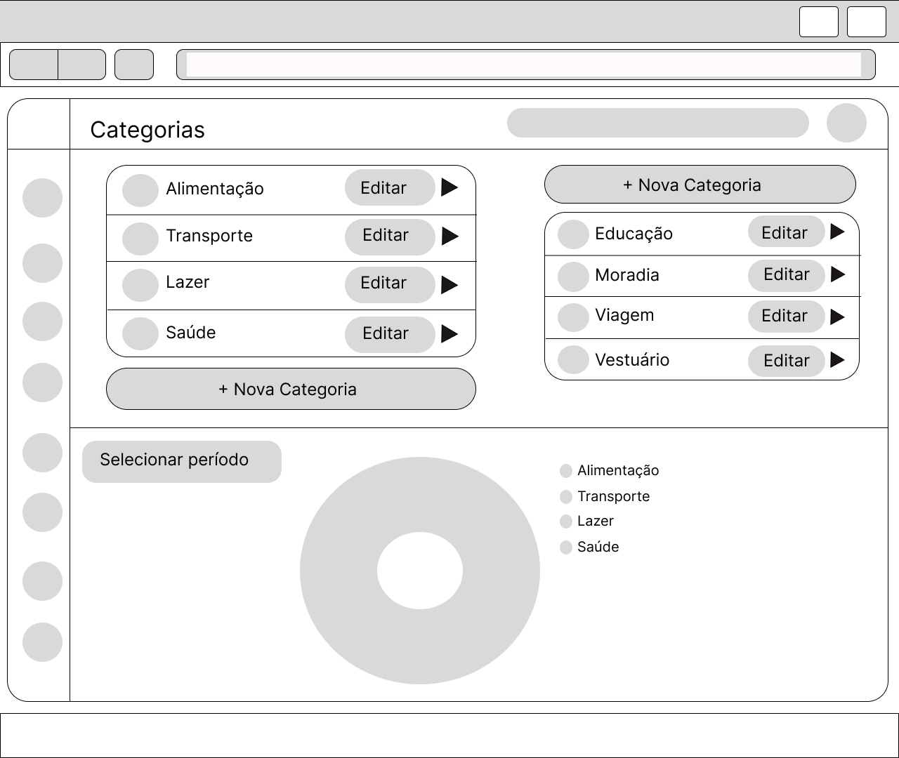 

## Painel de Planejamento e Economia Geral

Esta tela tem como objetivo dar uma visão geral de quanto a pessoa está economizando juntando as reservas de emergência e as metas específicas, onde esse valor aparece no card de ‘total economizado’. No card de média mensal, é a média de valor que essa pessoa consegue economizar por mês. No card de projeção nós temos uma simulação de quanto vai ser economizado em uma quantia determinada de meses, por exemplo, digamos que a pessoa tenha guardado uma média de R$750,00 reais mensal, e ela quer saber quanto vai ter juntado em 12 meses, é aqui nesse card que vai mostrar que nesse determinado tempo com essa quantia mensal ela irá economizar um total de R$9.000,00 reais. Além disso, também conta com um gráfico de evolução, que acompanha de forma visual o crescimento da economia ao longo dos meses.

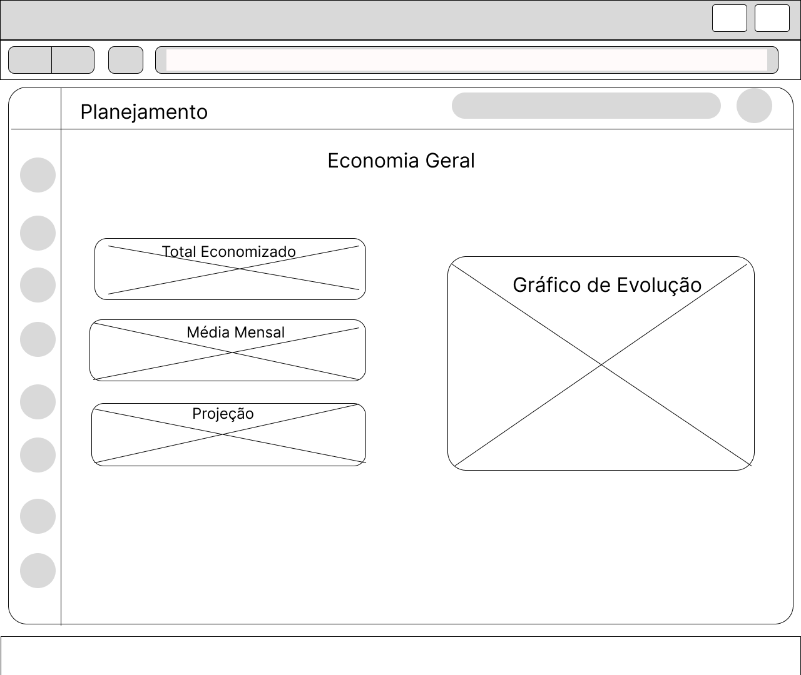 

## Painel de Planejamento Mensal e Metas

Essa tela tem como objetivo ajudar o usuário a controlar suas metas financeiras. Nela, é possível adicionar uma nova meta, definindo um nome, o valor que deseja alcançar e o prazo para isso. Cada meta conta com uma barra de progresso que mostra, de forma visual, como está o andamento. Ao lado, também aparece a porcentagem já atingida, facilitando o acompanhamento. Além disso, o usuário pode acessar os detalhes de cada meta, onde é possível visualizar melhor as informações e fazer alterações sempre que necessário.

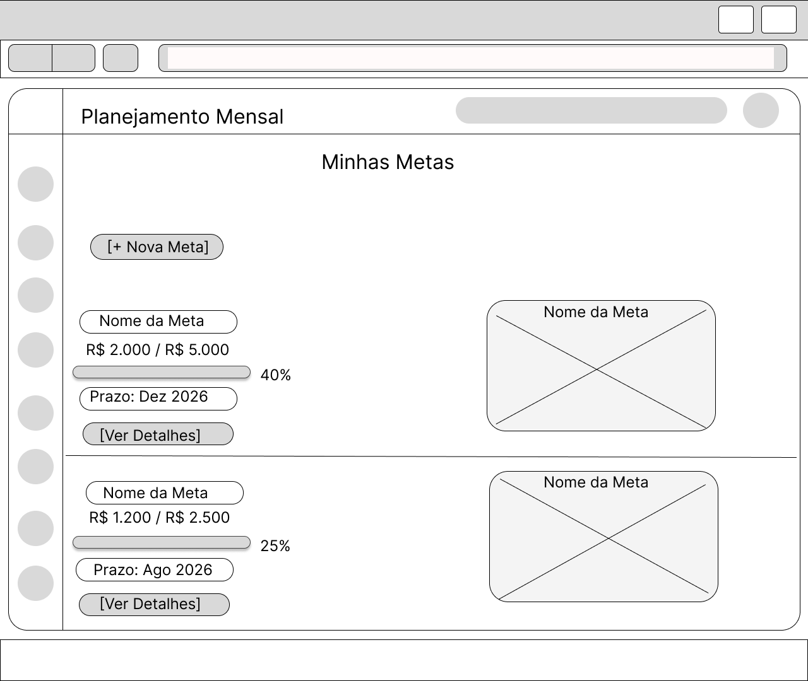 

## Detalhes do Planejamento Personalizado

O objetivo desta tela é ser um complemento da tela de metas. É aqui que o usuário irá fazer as alterações das metas definidas, como mudar o nome, o valor a ser alcançado, alterar o prazo da mesma e adicionar valor. Também conta com a quantia que ainda falta para alcançar o objetivo definido, e o histórico de valores que foram incluídos no progresso da mesma. 

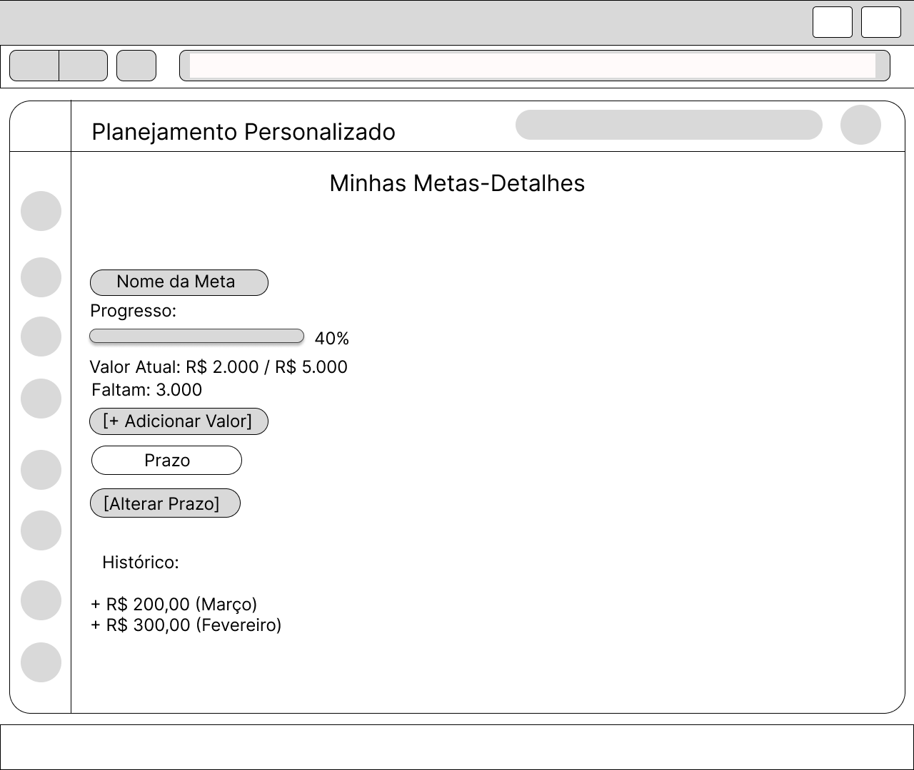 

## Painel de Reserva de Emergência

Essa tela tem como objetivo ajudar o usuário a acompanhar, organizar e planejar sua reserva financeira. Nela, ele consegue visualizar o valor já economizado, a meta ideal e o nível de cobertura das suas despesas mensais. O usuário pode adicionar valores à sua reserva e também ajustar a meta ideal que deseja alcançar. Além disso, o sistema mostra, com base no valor acumulado, por quantos meses ele conseguiria se manter. Há também um card de meta ideal, onde o usuário define quantos meses de cobertura deseja ter, considerando seus gastos mensais. Por fim, a tela conta com uma simulação que mostra quanto tempo será necessário para atingir a meta, com base em uma contribuição mensal, valor que o usuário pode ajustar facilmente.

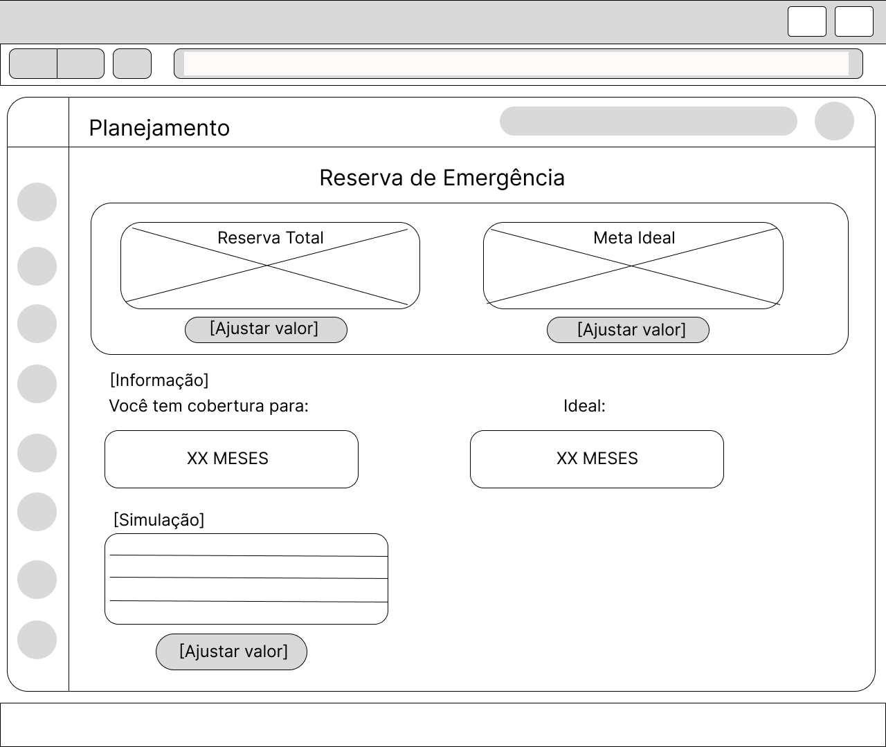 

## Educação Financeira 

Esta tela tem como objetivo ensinar o usuário a lidar melhor com o dinheiro, por meio de indicações de livros e documentários com temas relacionados à educação financeira. Além disso, na seção de cursos, haverá redirecionamento para sites confiáveis que oferecem conteúdos sobre diferentes áreas da educação financeira. Serão selecionadas as melhores opções para dar uma base sólida ao usuário sobre planejamento financeiro, investimentos e assuntos relacionados. A tela também contará com uma área de anotações, onde o usuário poderá registrar suas principais ideias e aprendizados, e uma seção de dicas financeiras com frases importantes acompanhadas do nome do autor, que serão atualizadas periodicamente.

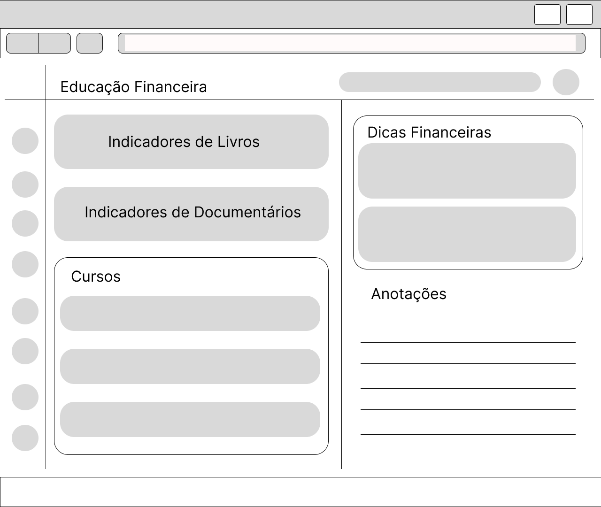 

## Configurações de Perfil do Usuário

Esta tela tem como objetivo exibir os dados do usuário, como nome completo, e-mail, senha (com opção de alteração), telefone e gênero, incluindo a opção “Prefiro não opinar”.

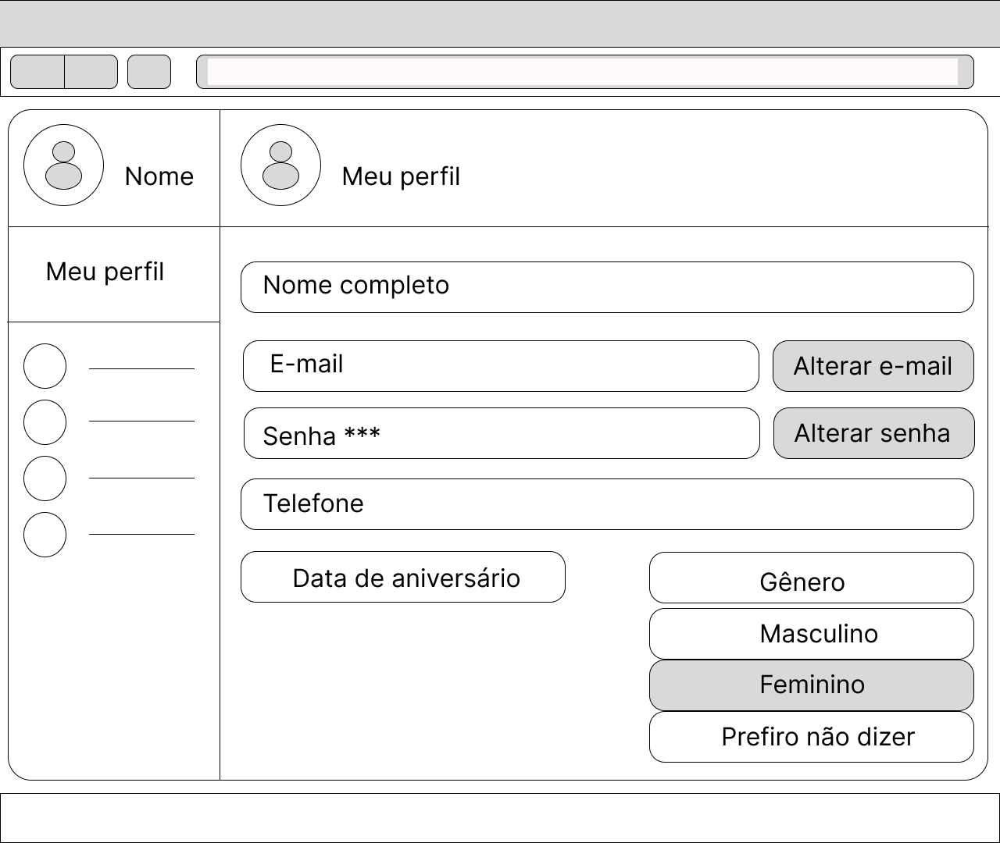 

## Configurações do Sistema 

Esta tela permite ao usuário personalizar e gerenciar as preferências da aplicação de acordo com suas necessidades. Nela, é possível configurar notificações, definir o idioma da interface, escolher entre modo claro ou escuro e acessar opções relacionadas à conta, como sair ou excluir o perfil. O objetivo é proporcionar maior controle, acessibilidade e uma experiência de uso adaptada ao usuário.

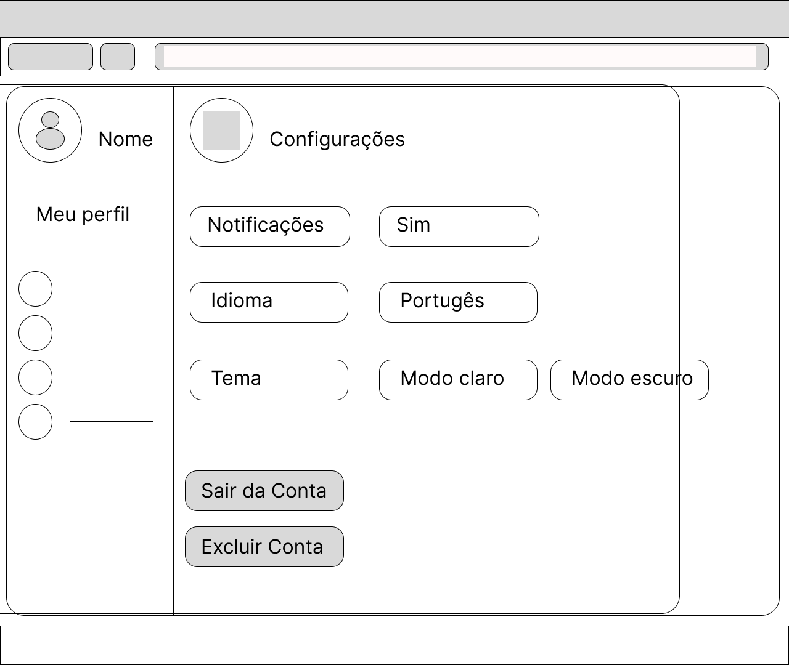 

### Protótipo Interativo

✅ [Protótipo interativo](https://www.figma.com/site/8a9xOcyFQPSZoIjSJSaHD1/Projeto-Gastos-Pessoais?node-id=0-1&p=f&t=lDQsMMXCJYpLJ02H-0) 
