# Arquitetura da solução

<span style="color:red">Pré-requisitos: <a href="05-Projeto-interface.md"> Projeto de interface</a></span>

O Planeja+ é uma aplicação web desenvolvida utilizando HTML, CSS e JavaScript, com Bootstrap para estilização, responsividade e Chart.js para a geração de gráficos. O sistema permite que o usuário realize o gerenciamento das suas finanças pessoais, cadastrando receitas e despesas, acompanhando o saldo, visualizando gráficos e controlando suas metas financeiras.
A arquitetura da aplicação é baseada no modelo cliente, onde o navegador executa toda a lógica da aplicação em JavaScript. Os dados são armazenados em formato JSON utilizando LocalStorage.

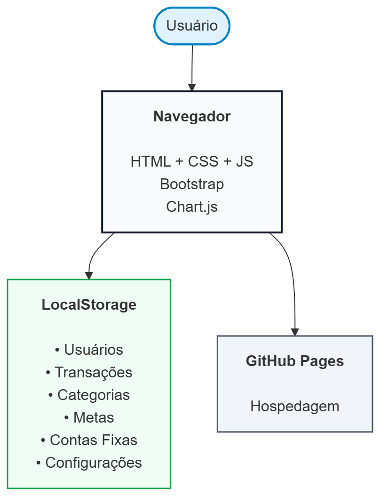

## Funcionalidades

Esta seção apresenta as funcionalidades da solução.

##### Funcionalidade 1 - Dashboard

Exibe um resumo da situação financeira do usuário, apresentando saldo atual, total de receitas, total de despesas e gráficos para facilitar o acompanhamento das finanças.

* **Estrutura de dados:** [Transações, Metas e Contas](#estrutura-de-dados---transações)
* **Instruções de acesso:**
  * Abra o site e efetue o login;
  * Selecionar Dashboard no menu lateral.
* **Tela da funcionalidade**:

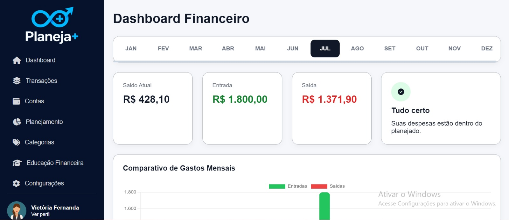
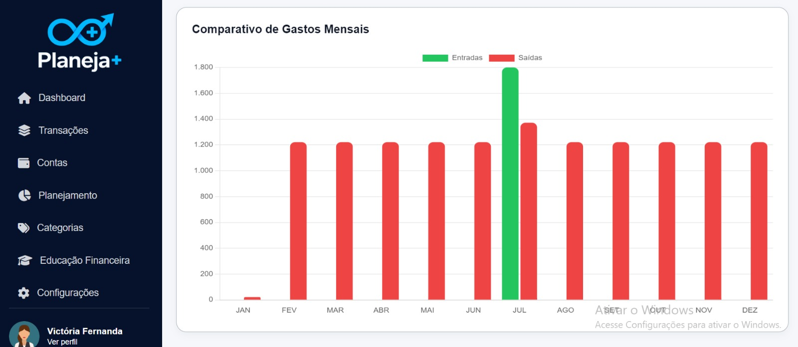
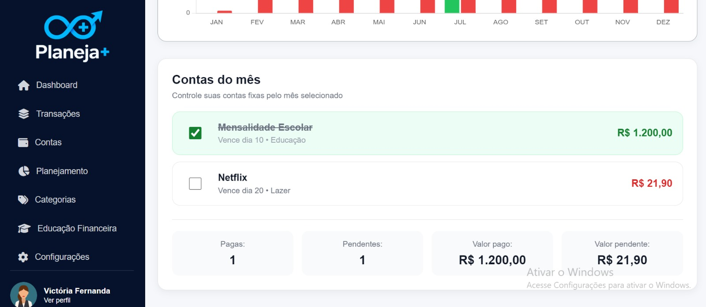

##### Funcionalidade 2 - Cadastro de Transações

Permite cadastrar, editar, excluir e consultar receitas e despesas da aplicação.

* **Estrutura de dados:** [Transações](#estrutura-de-dados---transações)
* **Instruções de acesso:**
  * Abra o site e efetue o login;
  * Acessar o menu "Transações";
  * Clicar em "Adicionar Receita";
  * Informar descrição, categoria, valor e data;
  * Salvar.
* **Tela da funcionalidade**:

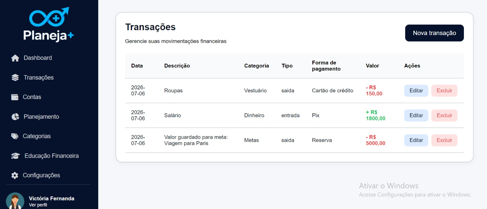
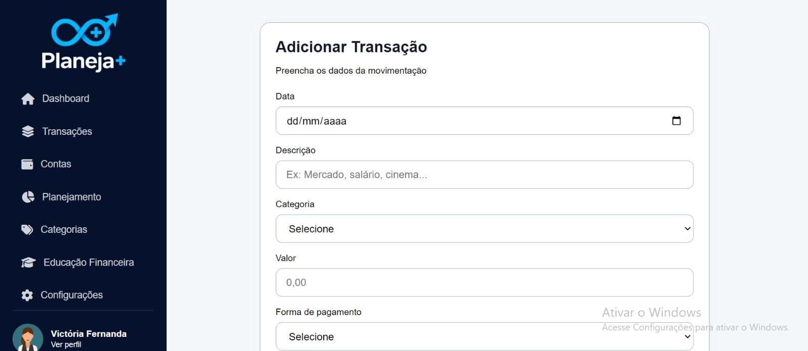

##### Funcionalidade 3 - Cadastro de Contas

Permite gerenciar contas fixas e recorrentes, auxiliando no controle de pagamentos mensais.

* **Estrutura de dados:** [Contas](#estrutura-de-dados---contas)
* **Instruções de acesso:**
  * Abra o site e efetue o login;
  * Acesse o menu principal e escolha a opção "Contas";
  * Adicionar, editar ou excluir contas.
* **Tela da funcionalidade**:

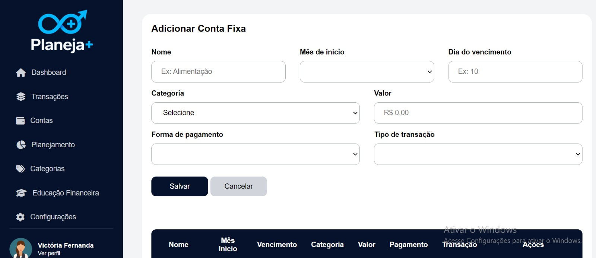
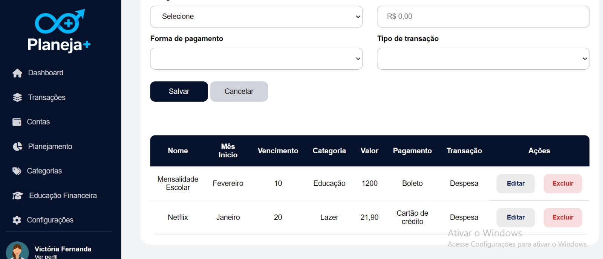

##### Funcionalidade 4 - Cadastro de Metas (Planejamento)

Permite criar metas financeiras e acompanhar o progresso para alcançá-las.

* **Estrutura de dados:** [Metas](#estrutura-de-dados---metas)
* **Instruções de acesso:**
  * Abra o site e efetue o login;
  * Acesse o menu principal e escolha a opção "Planejamento";
  * Cadastrar, editar ou excluir contas.
* **Tela da funcionalidade**:

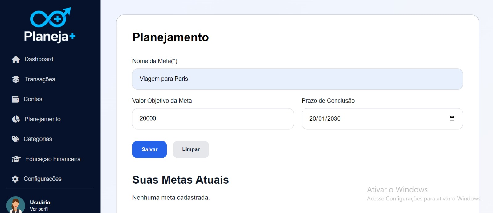
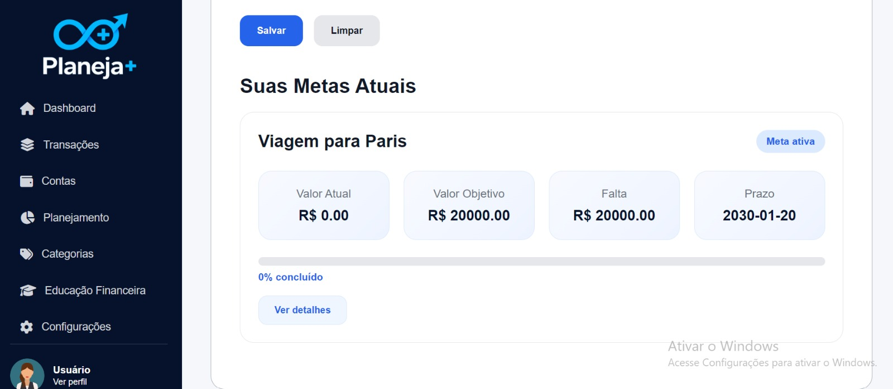
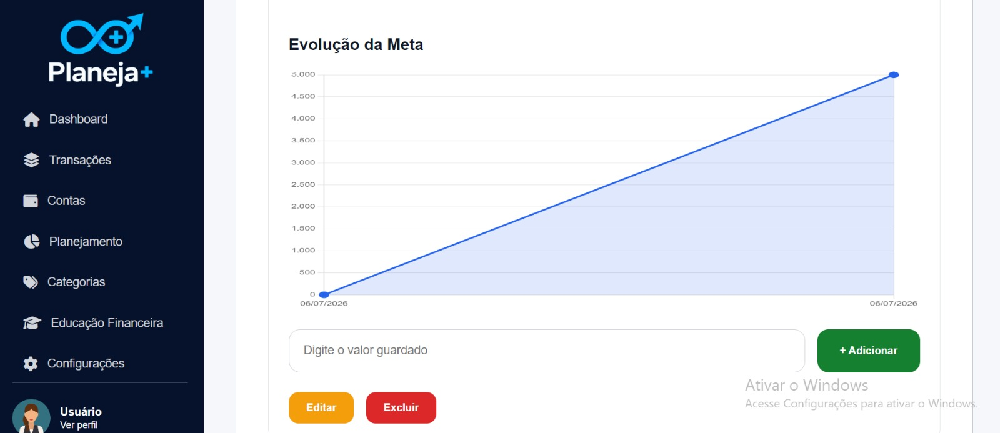

##### Funcionalidade 5 - Cadastro de Categorias

Permite cadastrar e organizar categorias utilizadas nas receitas e despesas.

* **Estrutura de dados:** [Categorias](#estrutura-de-dados---categorias)
* **Instruções de acesso:**
  * Abra o site e efetue o login;
  * Acesse o menu principal e escolha a opção "Categorias";
  * Criar, editar ou remover categorias.
* **Tela da funcionalidade**:

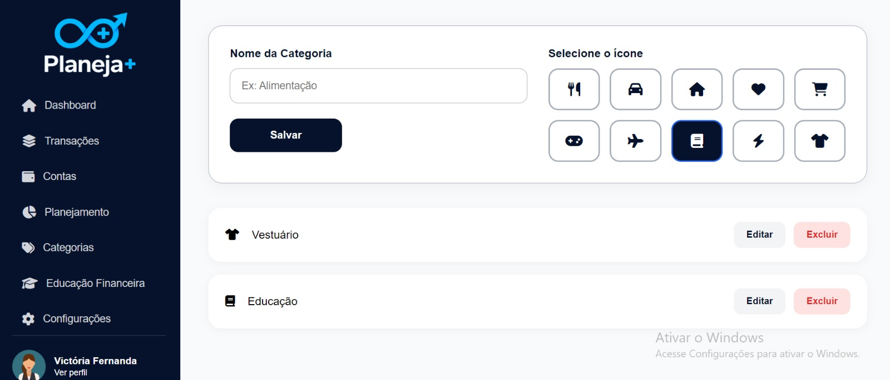

##### Funcionalidade 6 - Educação Financeira

Disponibiliza conteúdos educativos sobre finanças pessoais, planejamento financeiro, investimentos e organização do orçamento.

* **Estrutura de dados:** [Artigos](#estrutura-de-dados---artigos)
* **Instruções de acesso:**
  * Abra o site e efetue o login;
  * Acesse o menu principal e escolha a opção "Educação Financeira";
  * Selecionar o conteúdo desejado.
* **Tela da funcionalidade**:


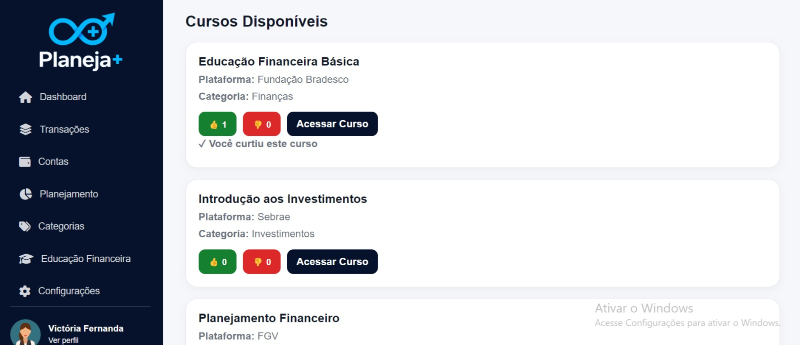

##### Funcionalidade 7 - Perfil/Configurações

Permite alterar informações do perfil do usuário e preferências da aplicação.

* **Estrutura de dados:** [Perfil](#estrutura-de-dados---usuários)
* **Instruções de acesso:**
  * Abra o site e efetue o login;
  * Acesse o menu principal e escolha a opção "Configurações";
  * Alterar os dados desejados e salvar.
* **Tela da funcionalidade**:

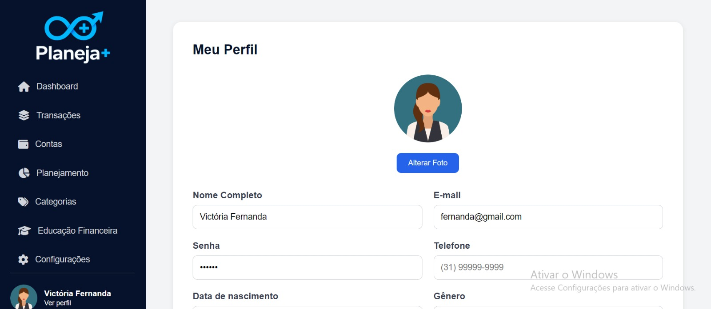
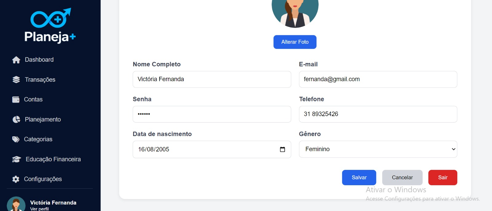

> ⚠️ **APAGUE ESTA PARTE ANTES DE ENTREGAR SEU TRABALHO**
>
> Apresente cada uma das funcionalidades que a aplicação fornece tanto para os usuários, quanto aos administradores da solução.
>
> Inclua, para cada funcionalidade, itens como: (1) títulos e descrição da funcionalidade; (2) estrutura de dados associada; (3) o detalhe sobre as instruções de acesso e uso.

### Estruturas de dados

Descrição das estruturas de dados utilizadas na solução com exemplos no formato JSON.Info.

##### Estrutura de dados - Contatos

Contatos da aplicação

```json
  {
    "id": 1,
    "nome": "Leanne Graham",
    "cidade": "Belo Horizonte",
    "categoria": "amigos",
    "email": "Sincere@april.biz",
    "telefone": "1-770-736-8031",
    "website": "hildegard.org"
  }
  
```

##### Estrutura de dados - Usuários  ⚠️ EXEMPLO ⚠️

Registro dos usuários do sistema utilizados para login e para o perfil do sistema.

```json
  {
    id: "eed55b91-45be-4f2c-81bc-7686135503f9",
    email: "admin@abc.com",
    id: "eed55b91-45be-4f2c-81bc-7686135503f9",
    login: "admin",
    nome: "Administrador do Sistema",
    senha: "123"
  }
```

> ⚠️ **APAGUE ESTA PARTE ANTES DE ENTREGAR SEU TRABALHO**
>
> Apresente as estruturas de dados utilizadas na solução tanto para dados utilizados na essência da aplicação, quanto outras estruturas que foram criadas para algum tipo de configuração.
>
> Nomeie a estrutura, coloque uma descrição sucinta e apresente um exemplo em formato JSON.
>
> **Orientações:**
>
> * [JSON Introduction](https://www.w3schools.com/js/js_json_intro.asp)
> * [Trabalhando com JSON - Aprendendo desenvolvimento web | MDN](https://developer.mozilla.org/pt-BR/docs/Learn/JavaScript/Objects/JSON)

### Módulos e APIs

Esta seção apresenta os módulos e APIs utilizados na solução.

**Frameworks**:

* HTML5 - [https://developer.mozilla/](https://developer.mozilla.org/pt-BR/docs/Web/HTML/)
* CSS3 - [https://developer.mozilla/](https://developer.mozilla.org/pt-BR/docs/Web/CSS/)
* JavaScript - [https://developer.mozilla/](https://developer.mozilla.org/pt-BR/docs/Web/JavaScript/)
* Bootstrap 5- [https://getbootstrap.com/](https://getbootstrap.com/)


**Bibliotecas**:

* Chart.js - [https://www.chartjs.org/](https://www.chartjs.org/)
* Font Awesome - [https://fontawesome.com/](https://fontawesome.com/)
* Chart.js - [https://sweetalert2.github.io/](https://sweetalert2.github.io/)

**Bibliotecas**:

* LocalStorage (Web Storage API) - [https://developer.mozilla/](https://developer.mozilla.org/pt-BR/docs/Web/API/Window/localStorage/)


**Ferramentas**:

* Visual Studio Code - [https://code.visualstudio.com/](https://code.visualstudio.com/)
* Git - [https://git-scm.com/](https://git-scm.com/)
* GitHub - [https://github.com/](https://github.com/)

## Hospedagem

Explique como a hospedagem e o lançamento da plataforma foram realizados.

> **Links úteis**:
> - [Website com GitHub Pages](https://pages.github.com/)
> - [Programação colaborativa com Repl.it](https://repl.it/)
> - [Getting started with Heroku](https://devcenter.heroku.com/start)
> - [Publicando seu site no Heroku](http://pythonclub.com.br/publicando-seu-hello-world-no-heroku.html)
